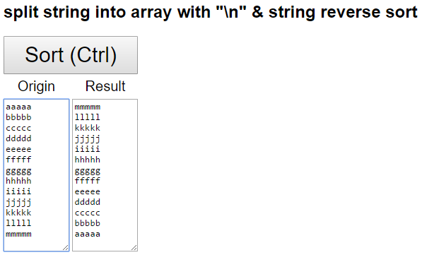

# js-learn
## [[Demo](https://codepen.io/titangene/pen/aWgybx)] [split string into array with "\n" & string reverse sort](https://github.com/titangene/js-learn/blob/master/other/string_reverse_sort.html)

## [[Demo](https://codepen.io/titangene/pen/YVmGgp), [RWD](https://material.io/resizer/#url=https%3A%2F%2Fcodepen.io%2Ftitangene%2Ffull%2FYVmGgp%2F)] [Google maps](https://github.com/titangene/js-learn/blob/master/google_maps/index.html)

